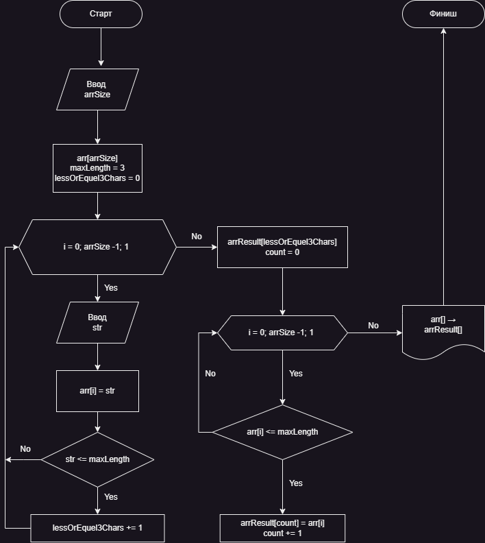

# Текстовое описание решения задачи контрольной работы по основному блоку.

## Задача. 
_Написать программу, которая из имеющегося массива строк формирует новый массив из строк, длина которых меньше, либо равна 3 символам. Первоначальный массив можно ввести с клавиатуры, либо задать на старте выполнения алгоритма. При решении не рекомендуется пользоваться коллекциями, лучше обойтись исключительно массивами._

## Решение.
1. Получаем размер массива от пользователя
2. Создаем массив указанного пользователем размера
3. Получаем строки для заполнения созданного массива от пользователя
4. Заполненяем массив строками
5. Подсчитываем количество строк с количеством символов меньше или равным 3 и сохраняем в переменную _lessOrEquel3Chars_
6. Созданем новый массив размером равным числу в переменной _lessOrEquel3Chars_
7. Заполняем новый массив значениями из старого массива, если значение соответствует требованию (длина строки меньше, либо равна 3 символам)
8. Выводим новый массив на экран.

## Блок-схема алгоритма
